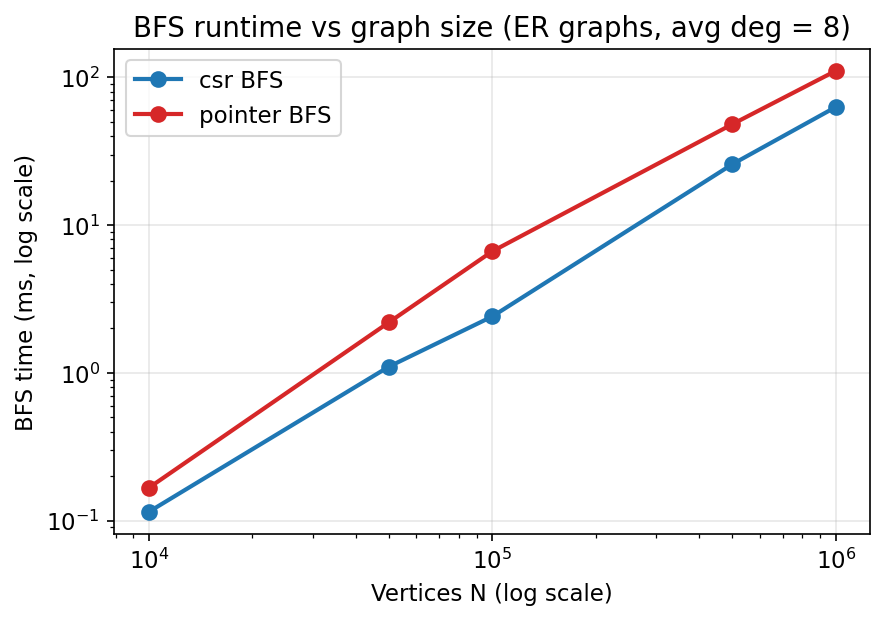
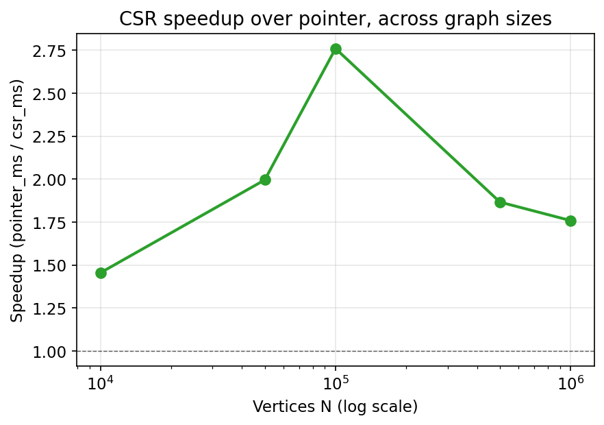
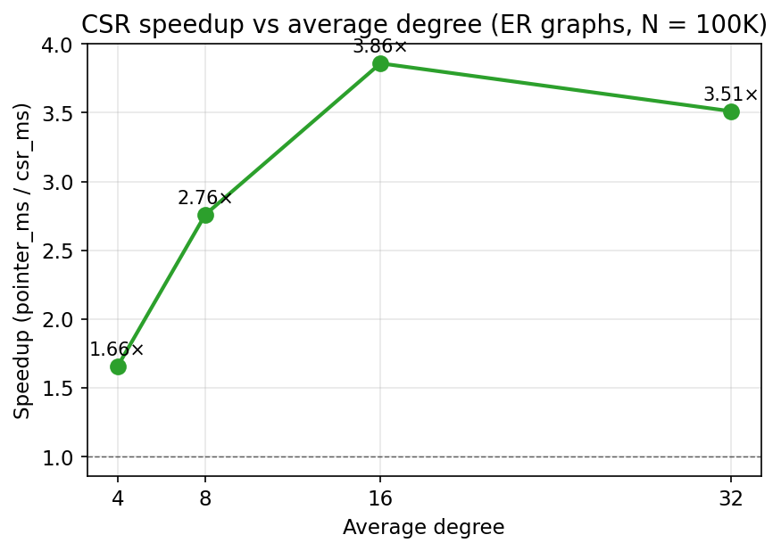
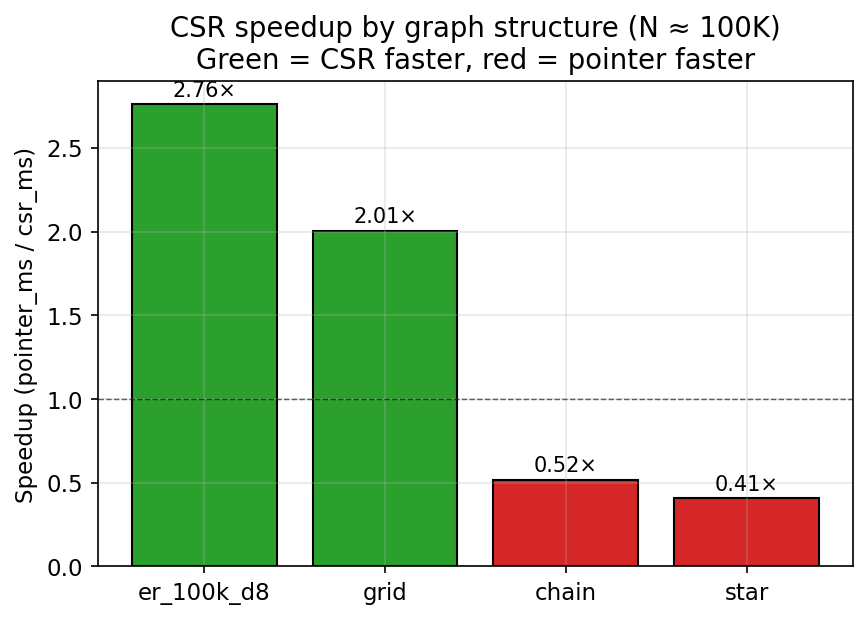
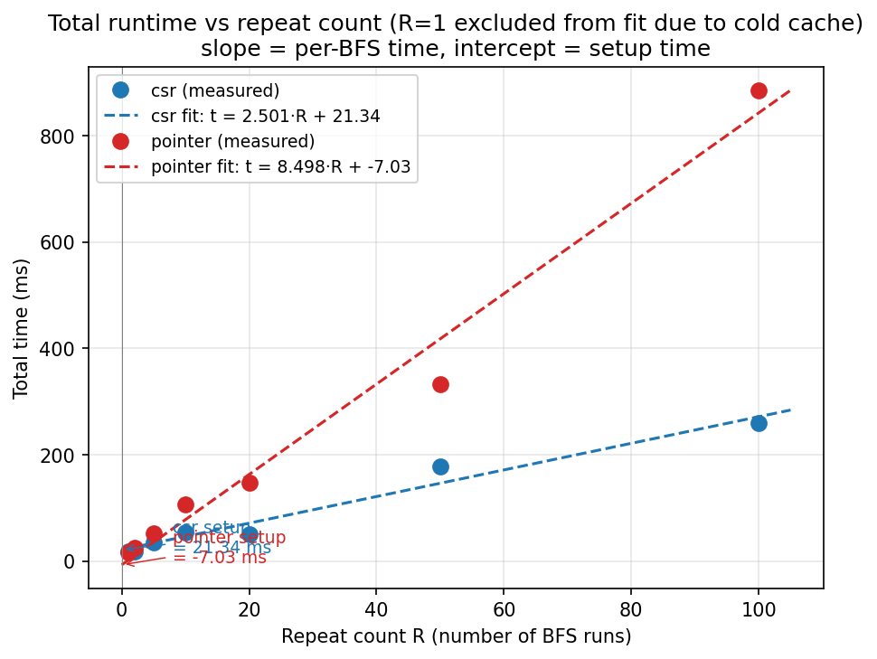
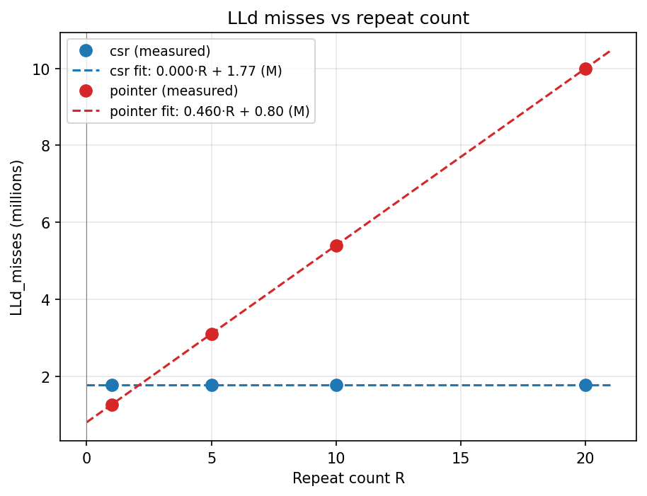
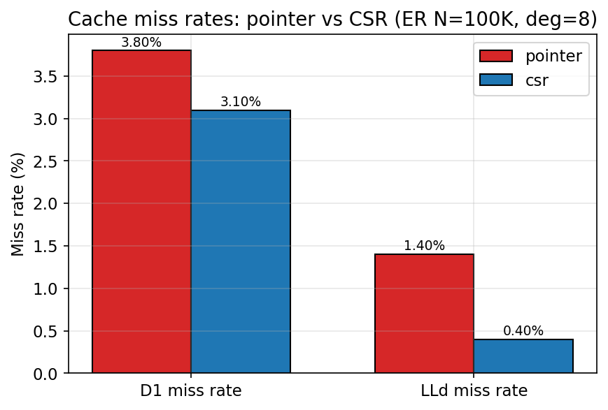
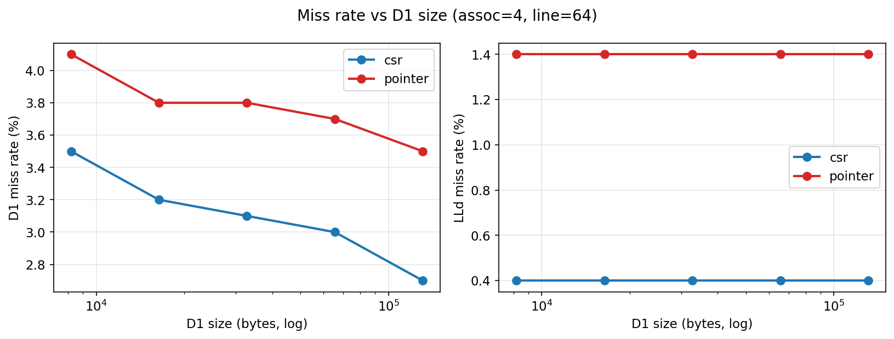
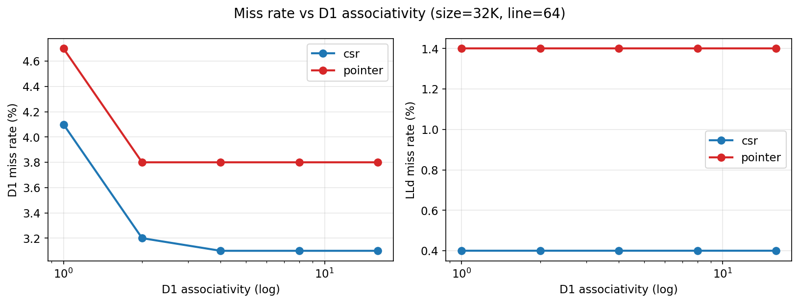
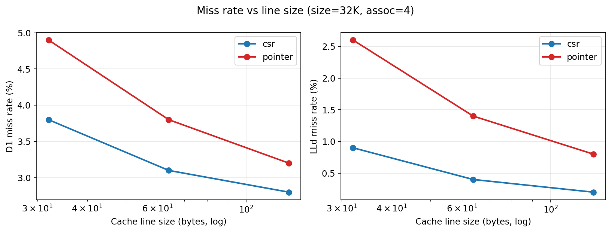

# 1. Introduction

In this assignment we compared two BFS implementations: one on a pointer-based adjacency list and one on CSR (Compressed Sparse Row). The BFS algorithm itself is the same in both, only the way the graph is stored in memory is different. The goal is to see how much the memory layout affects performance.

# 2. Implementation Notes

Both BFS versions use a fixed-size array as a queue (size N, since BFS visits each vertex at most once). This way there is no memory allocation during the traversal, so the timing mostly reflects the graph access cost.

For `convert_to_csr`, we did two passes: first count the total edges, then fill `row_ptr` and `col_idx`. The edge order is kept the same as the pointer graph, so both BFS versions visit neighbors in identical order. All visited counts match between the two impls on every test, so the algorithms are equivalent.

# 3. Setup

- **Compiler:** `gcc -O2 -std=gnu11 -Wall -Wextra -pedantic`
- **Cache simulator:** Valgrind 3.22 Cachegrind, run with `--cache-sim=yes`
- **Baseline cache config:** D1 = 32 KB / 4-way / 64 B, LL = 8 MB / 16-way / 64 B
- **Graphs:** ER (N = 10K to 1M, deg 4 to 32), grid, chain, star
- **Timing:** minimum across 7 runs, each with `--repeat=20` (so the cache is warm)

Cachegrind runs about 30x slower than native, so we only ran the cache experiments on the ER-100K-d8 graph. It's big enough that BFS dominates but small enough to finish quickly.

# 4. Runtime Analysis

## 4.1 Runtime vs graph size

We ran BFS on ER graphs with degree 8 and N from 10K to 1M.

| N | pointer (ms) | CSR (ms) | speedup |
|---|---|---|---|
| 10K | 0.17 | 0.11 | 1.45x |
| 50K | 2.20 | 1.10 | 2.00x |
| 100K | 6.64 | 2.41 | 2.76x |
| 500K | 48.19 | 25.82 | 1.87x |
| 1M | 110.68 | 62.95 | 1.76x |

{ width=75% }

{ width=75% }

Interesting thing: the speedup is not monotonic. It goes up from 1.45x at N=10K to 2.76x at N=100K, then drops to about 1.8x at N=1M. We think this happens because at small N both graphs fit in L2/L3 cache so layout doesn't matter much. At very large N both are too big for the cache, so both are DRAM-bound and the gap narrows. At N=100K CSR fits nicely in LL but pointer is already spilling out, which is the sweet spot for CSR.

Also, if we compute time per edge (treating degree as 8, so edges = N*8):

| N | pointer (ns/edge) | CSR (ns/edge) |
|---|---|---|
| 10K | 2.1 | 1.4 |
| 100K | 8.3 | 3.0 |
| 1M | 13.8 | 7.9 |

So CSR stays around 2x faster per edge even at 1M. The per-edge cost goes up for both as N grows because of cache pressure.

## 4.2 Runtime vs average degree

All N=100K, only degree changes.

| avg degree | pointer (ms) | CSR (ms) | speedup |
|---|---|---|---|
| 4 | 2.77 | 1.67 | 1.66x |
| 8 | 6.64 | 2.41 | 2.76x |
| 16 | 15.29 | 3.96 | 3.86x |
| 32 | 29.66 | 8.45 | 3.51x |

{ width=70% }

Higher degree = longer neighbor lists, so CSR gets to scan more consecutive ints per cache line. That's exactly where CSR wins. The slight dip at d=32 is probably because the graph is large enough that even CSR starts missing LL more.

## 4.3 Runtime by graph structure

At N around 100K, different graph shapes:

| graph | pointer (ms) | CSR (ms) | speedup |
|---|---|---|---|
| ER d=8 | 6.64 | 2.41 | 2.76x |
| grid 317x317 | 1.78 | 0.89 | 2.01x |
| chain | 0.38 | 0.74 | **0.52x** |
| star | 0.20 | 0.50 | **0.40x** |

{ width=75% }

This was surprising - CSR is actually slower than pointer on chain and star graphs. For chain, every vertex has exactly 1 neighbor, so there's no long scan to take advantage of. But CSR still does two array lookups per vertex (`row_ptr[v]` and `row_ptr[v+1]`), while pointer just does one (`vertices[v].head`). So CSR's overhead per vertex is higher, and the benefit doesn't apply when the list has only one element.

For star, one vertex has ~100K neighbors but all others have zero. BFS finishes mostly in the hub's one big scan, which both layouts handle fine, and then the remaining vertices just pay CSR's constant overhead with no work.

So CSR isn't always better. It's only better when there are long enough adjacency lists to take advantage of the sequential layout.

## 4.4 Per-BFS cost vs setup cost

The numbers in 4.1 mix the per-BFS time with the one-time setup cost (loading the graph, plus building the CSR for the csr impl). To separate them, we ran with `--repeat` varying from 1 to 100 and fit a line to (R, total_time): slope = per-BFS time, intercept = setup.

{ width=75% }

Slopes from the fit:

- pointer: about 8.5 ms per BFS
- csr: about 2.5 ms per BFS

So the per-BFS ratio is roughly 3.4x, which matches the 4.1 numbers. The intercepts were noisy (pointer's came out slightly negative due to drift at large R), so we don't quote a precise conversion-overhead number, but qualitatively csr's setup is clearly higher because of `convert_to_csr`.

The cache-miss version of the same fit gave a much cleaner result:

{ width=75% }

| impl    | LLd misses per BFS |
|---------|-------------------:|
| pointer | ~460K              |
| csr     | ~0                 |

This is the strongest cache finding we got. CSR's per-BFS LLd misses are basically zero - all 1.77M LLd misses happen during setup, and every BFS after the first runs entirely from LL cache without any DRAM trips. Pointer keeps incurring 460K LLd misses every single BFS because its scattered heap data doesn't fit in 8 MB LL.

So CSR's cache advantage actually *compounds* with repeated use: the more times you run BFS on the same graph, the bigger the win. For applications that build the graph once and run many traversals (search, network analysis), this matters a lot.

# 5. Q2 - Cache Behavior

Using cachegrind on ER N=100K, degree 8:

{ width=70% }

|  | D1 miss rate | LLd miss rate | D1 misses | LLd misses |
|---|---|---|---|---|
| pointer | 3.80% | 1.40% | 14,630,794 | 5,398,799 |
| CSR | 3.10% | 0.40% | 12,308,717 | 1,770,862 |
| ratio | 1.23x | **3.50x** | 1.19x | **3.05x** |

The D1 rates are close (1.23x ratio). That's because both impls have a working set of several MB which is way bigger than 32KB L1 anyway, so both are missing L1 a lot regardless of layout.

The big difference is at the last level: pointer has 3.05x more LLd misses, meaning 3x more trips to DRAM. This is where the real time goes. And this ratio (3.05x) is very close to the runtime speedup (2.76x). So the cache behavior basically explains the runtime.

The ratios don't match exactly - runtime is 2.76x but misses are 3.05x. The difference is probably because CSR's sequential access lets the CPU overlap memory loads with other work better than pointer chasing does, so not every DRAM trip stalls the CPU for the full latency.

# 6. Q3 - Why CSR Wins

Three main reasons.

**Spatial locality.** CSR stores all of vertex v's neighbors as consecutive ints in `col_idx`. A 64-byte cache line fits 16 ints, so one cache miss brings in 16 useful neighbor IDs. With the pointer graph, each `Edge` is a separate malloc, scattered around the heap. A 64-byte line fetched for one edge has only 16 bytes of useful Edge data and 48 bytes of other stuff. So CSR uses about 16x more of each cache line.

**Pointer chasing.** In the pointer graph, you can only know where the next edge is after loading the current one (because you have to read `e->next`). So memory loads happen one at a time and each one stalls the CPU. In CSR, the next neighbor's address is just `col_idx[i+1]` which is predictable, so the hardware prefetcher can stream cache lines ahead of time.

**Allocation overhead.** The pointer graph does one malloc per edge, so 800K small allocations for 100K vertices with degree 8. These get spread across the heap, which also increases TLB pressure. CSR does two big contiguous allocations, so TLB misses are basically zero.

```
Pointer graph layout:
  v0.head -> [dst|next] ---> [dst|next]   (each arrow could be a cache miss)
             (scattered across heap)

CSR layout:
  row_ptr: [0, 8, 16, 24, ...]
  col_idx: [3, 7, 2, 9, 5, 1, ...]   (all contiguous, prefetcher-friendly)
            -v0--   -v1--
```

# 7. Q4 - Varying Cache Parameters

All three sweeps on ER N=100K d=8. The baseline (32K / 4-way / 64B) is in the middle of each sweep range.

## 7.1 D1 size sweep (assoc=4, line=64)

{ width=90% }

| D1 size | pointer D1 | CSR D1 | pointer LLd | CSR LLd |
|---|---|---|---|---|
| 8 KB | 4.10% | 3.50% | 1.40% | 0.40% |
| 32 KB | 3.80% | 3.10% | 1.40% | 0.40% |
| 128 KB | 3.50% | 2.70% | 1.40% | 0.40% |

Making the L1 cache 16x bigger (8KB to 128KB) only reduces D1 miss rate by a small amount (0.6 points for pointer, 0.8 for CSR). And LLd miss rate doesn't change at all across the whole sweep.

This makes sense - the number of unique cache lines BFS touches is fixed by the graph size, not the L1 size. Those lines have to come from L2/LL on the first reference no matter how big L1 is. Beyond 32KB, making L1 bigger has basically no effect because the working set is way bigger than that anyway.

## 7.2 Associativity sweep (size=32K, line=64)

{ width=90% }

| assoc | pointer D1 | CSR D1 | pointer LLd | CSR LLd |
|---|---|---|---|---|
| 1 | 4.70% | 4.10% | 1.40% | 0.40% |
| 2 | 3.80% | 3.20% | 1.40% | 0.40% |
| 4 | 3.80% | 3.10% | 1.40% | 0.40% |
| 8 | 3.80% | 3.10% | 1.40% | 0.40% |
| 16 | 3.80% | 3.10% | 1.40% | 0.40% |

Direct-mapped (assoc=1) is clearly worse - hot cache lines keep evicting each other. But from 2-way onwards, nothing changes. So 4-way (the baseline) is plenty. Real CPUs usually have 4 to 8 way associative L1, which matches what we see.

## 7.3 Line size sweep (size=32K, assoc=4)

{ width=90% }

| line | pointer D1 | CSR D1 | pointer LLd | CSR LLd |
|---|---|---|---|---|
| 32 | 4.90% | 3.80% | 2.60% | 0.90% |
| 64 | 3.80% | 3.10% | 1.40% | 0.40% |
| 128 | 3.20% | 2.80% | 0.80% | 0.20% |

This one shows the biggest changes. Doubling the line size from 64 to 128 roughly halves the LLd miss rate for both. Absolute LLd misses: pointer goes from 5.4M to 3.0M (1.8x reduction), CSR goes from 1.77M to 0.89M (2.0x reduction).

So CSR benefits more from bigger lines, in absolute terms. This makes sense - CSR does sequential access, so every byte in a wider cache line is useful (128-byte line = 32 consecutive neighbor IDs). For pointer, a wider line still only contains a couple of useful Edge structs surrounded by unrelated heap data. So CSR's speedup scales with line size more cleanly than pointer's does. This is one reason CSR is preferred on modern hardware where cache lines are 64 or 128 bytes.

We could not test 16-byte line size because cachegrind 3.22 rejects it. 32 was the minimum it accepted.

# 8. Limitations

We only ran cachegrind on one graph (ER N=100K d=8). The structure sweep in 4.3 shows runtime does vary a lot by graph type (CSR even loses on chain and star), so strictly speaking the cache sweeps in Q4 only prove the trends for this one graph. We'd expect similar trends on other dense graphs but didn't have time to verify all of them.

Also, the line-size sweep doesn't include 16-byte lines because cachegrind rejects those. 32/64/128 is enough to show the trend though.

# 9. Conclusion

The BFS algorithm is the same in both implementations, but the runtime differs by up to 3.86x on dense graphs. Cachegrind shows why: pointer BFS has 3x more last-level cache misses than CSR, which means 3x more DRAM accesses. This ratio (3x) matches the runtime gap (~2.8x) fairly closely, so the cache behavior explains most of the runtime difference.

CSR wins when there are long adjacency lists to scan sequentially (dense ER, grid). It actually loses when lists are too short to amortize its overhead (chain, star). So CSR is not universally better - but on the kinds of graphs where cache-friendly layouts actually matter in practice (moderately dense, irregular), it's a clear win.

The 4.4 repeat sweep also shows that CSR's advantage actually compounds with repeated use - per-BFS LLd misses for CSR are essentially zero, so every BFS after the first runs entirely from cache. So for workloads that build a graph once and traverse it many times, CSR's win gets bigger the more you use it.